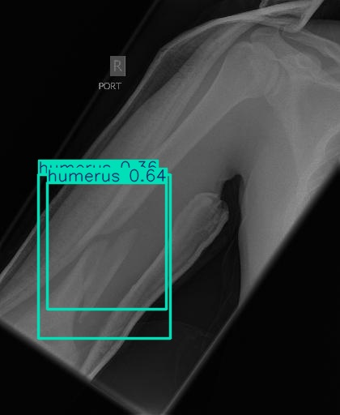
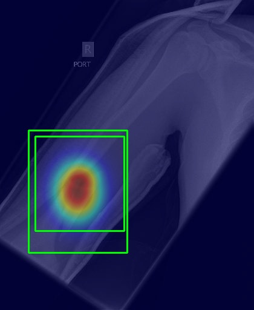

<div align="center">
  
# MediDiagnose: AI-Powered Disease Detection Platform

</div>

<div align="center">
  


</div>

<p align="center">
  <i>AI-powered diagnostic platform for fast, accurate detection of bone fractures and other diseases from medical images.</i>
</p>

## 📋 Overview

**MediDiagnose** is a cutting-edge AI-based web application that assists healthcare professionals in diagnosing diseases from medical images. Initially focused on bone fracture detection, the system is designed to expand into broader disease detection using deep learning models. It uses YOLOv8 for object detection and Grad-CAM for model interpretability.

## ✨ Key Features

- 🔍 **Advanced Detection**: Detects bone fractures (transverse, oblique, spiral, etc.) with high accuracy
- 🧠 **AI-Powered**: Built using YOLOv8 and deep learning
- ⚡ **Fast Inference**: Image processing in under 2 seconds
- 🔬 **Grad-CAM Visualization**: Visual explanations for model predictions
- 🌐 **Web Interface**: Easy-to-use UI for clinicians
- 🔄 **API Access**: RESTful API endpoints for easy integration
- 🔮 **Future Ready**: Expandable to other disease domains beyond fractures

## 🖼️ Screenshots

<div align="center">
  <table>
    <tr>
      <td><strong>Detection Results</strong></td>
      <td><strong>Grad-CAM Visualization</strong></td>
    </tr>
    <tr>
      <td></td>
      <td></td>
    </tr>
  </table>
</div>

## 🏗️ Architecture

MediDiagnose consists of two main components:

1. **Backend (FastAPI)**: Processes images, runs AI models, returns results
2. **Frontend (HTML/CSS/JS)**: Provides UI for image upload, results, Grad-CAM visualizations

## 🛠️ Technology Stack

- **Backend**: Python, FastAPI, PyTorch, Ultralytics YOLOv8, OpenCV
- **Frontend**: HTML5, CSS3, JavaScript
- **Model**: YOLOv8 trained on medical image datasets
- **Explainability**: Grad-CAM (for model transparency)

## 📂 Project Structure

```
├── graphs/
├── models/
├── backend/
│   ├── app.py
│   ├── requirements.txt
│   ├── results/
│   └── uploads/
├── frontend/
│   ├── index.html
│   ├── detect.html
│   ├── gradcam.html
│   ├── about.html
│   ├── team.html
│   └── images/
├── requirements.txt
└── README.md
```

## 🚀 Getting Started

### Prerequisites

- Python 3.8+
- pip
- Modern browser

### Installation

```bash
git clone https://github.com/yourusername/medidiagnose.git
cd medidiagnose
pip install -r requirements.txt
```

### Backend

```bash
cd backend
uvicorn app:app --reload
```

### Frontend

```bash
cd frontend
python -m http.server 8080
# Visit http://localhost:8080
```

## 📡 API Endpoints

| Endpoint | Method | Description |
|----------|--------|-------------|
| `/` | GET | API status |
| `/status` | GET | System status |
| `/detect` | POST | Upload & analyze image |
| `/gradcam/{image_id}` | GET | Grad-CAM visual for image |

### Example

```python
import requests

with open('xray.jpg', 'rb') as f:
    files = {'file': f}
    response = requests.post('http://localhost:8000/detect', files=files)

print(response.json())
```

## 💻 Developer Setup

```bash
python -m venv env
source env/bin/activate  # Windows: env\Scripts\activate
pip install -r requirements.txt
cd backend
uvicorn app:app --reload
```

## 👥 Team

**V A Dinesh** – Full Stack AI/ML Engineer

## 📜 License

MIT License – see LICENSE

## 🙏 Acknowledgements

- [Ultralytics YOLOv8](https://github.com/ultralytics/ultralytics)
- [FastAPI](https://fastapi.tiangolo.com/)
- Medical partners for expert validation

<div align="center">
  <p>Made with ❤️ to improve global healthcare diagnostics</p>
  <p>© 2025 MediDiagnose Team</p>
</div>